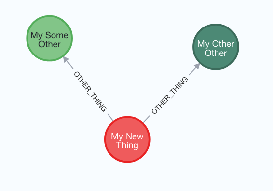

Pangloss-Core
=============


## Prosopography And Networks Graph-Labyrinth Orientation-System 🔆

↑ (acronym working very hard)

> "All is for the best in the best of all possible worlds" — Voltaire

↑↑ DISCLAIMER: Current status: really awfully hackily proof-of-concepty. On no account use it for anything.

<br>
<hr>

### A Graph Database, data modelling and API system using neo4j, Pydantic and FastAPI
<br>

#### General idea
The point of this proof-of-concept is to allow easy(ish) creation of graph databases by defining models in Python, and having an API with FastAPI.

The main design goal is to provide the API with an arbitrarily nested JSON object of related objects, and have it parsed into graph nodes and relations with a single request (and one database query).

So you can take some models like this:

```python
class Thing(BaseNode):
    name: str
    other_thing: Annotated[
        RelationTo[SomeOther | OtherOther],
        RelationConfig(reverse_name="belongs_to_thing"),
    ]


class SomeOther(BaseNode):
    age: int


class OtherOther(BaseNode):
    size: int
```

Have an API defined by FastAPI, and then throw some JSON at it:

```json
{
  "label": "My New Thing",
  "realType": "thing",
  "name": "Such a Great Thing",
  "otherThing": [
    {
      "uid": "3fa85f64-5717-4562-b3fc-2c963f66afa6",
      "label": "My Other Thing",
      "realType": "otherother"
    },
    {
      "uid": "3fa85f64-5717-4562-b3fc-2c963f66afa6",
      "label": "My Some Other",
      "realType": "someother"
    }
  ]
}
```

And end up with:



#### Installation

Requires *Python 3.12*!

- Create a new folder with Poetry.

 - Install `pangloss_core` from GitHub (for now):

```bash
poetry add git+https://github.com/richardhadden/pangloss-core.git
```

- Create a new Pangloss Project ('Projects' contain database and other settings, and the installed apps, and the `app` object initialised by `uvicorn`):

```bash
pangloss createproject <project-name>
```

- Create a Pangloss App ('Apps' contain data models in `model.py`, and eventually some other stuff):

```bash
pangloss createapp <app-name>
```

- Add the new app to `INSTALLED_APPS` in `<Project>.settings.py` `Settings` object:

```python
class Settings(BaseSettings):
    PROJECT_NAME: str = "MyTestApp"
    BACKEND_CORS_ORIGINS: list[AnyHttpUrl] = []

    DB_URL: str = "bolt://localhost:7687"
    DB_USER: str = "neo4j"
    DB_PASSWORD: str = "password"
    DB_DATABASE_NAME: str = "neo4j"

    INSTALLED_APPS: list[str] = ["pangloss_core", "<ADD APP HERE>"] # <-- Add it here
```

- Also configure the database settings

- Fire up an instance of neo4j, with the APOC library installed (lazy? Run `sh neo4jdocker.sh`!)

## Modelling

### Basic models

Models are declared using Pydantic classes, with some custom classes built in (which are greatly modified on model instantiation).

Models inherit from `pangloss_core.models.BaseNode`, e.g.:

```python
class Thing(BaseNode):
    name: str
    age: int
    tags: list[str]
```
- anything that can translate to properties of a node in neo4j are legit
- but! there's no checking that this is the case yet
- `BaseNode` has extra fields: `uid` (a UUID for the node), `label` (a required text label)

Models can also inherit, which assigns the label of both parent model and the actual model. All fields are inherited.

Models can also be abstract. Add `__abstract__ = True` to the model. Any model in a hierarchy can be abstract. Abstract models can't be created — only subtypes of the abstract class. Abstract models can be the object of a relation (as long as it has some sub-types, otherwise it makes no sense!), and viewable as a list from the API.

### Relationships

Relationships are *always* **always** directional, defined on the 'origin' class.

Relationships are defined using `Annotated[]` (from Typing module) types comprising, 1) `RelationTo[<RelatedClass>]`, and 2) a `RelationConfig` object, with minimally a `reverse_name` property defined.

```python
class Person(BaseNode):
    has_pets: Annotated[
                RelationTo[Pet], 
                RelationConfig(reverse_name="is_pet_of")]

class Pet(BaseNode):
    name: str

class PetDog(Pet): 
    pass

class PetCat(Pet):
    pass
```

(Here, Person can have pet of any `Pet` type: `Pet`, `PetDog`, `PetCat`)

Also, relations can take `typing.Union` types (for when hierarchy doesn't make sense):

```python
class Pet(BaseNode):
    name: str

class Brick(BaseNode): # yes people can have pet bricks oh yes
    hardness: int

class Person(BaseNode):
    has_pets: Annotated[
                RelationTo[Pet | Brick], # <-- relation to union of types
                RelationConfig(reverse_name="is_pet_of")]
```


Relations can have properties, by providing an additional model (included in the API as `relation_properties` on the related model), e.g.:

```python
class PersonHasPetsModel(RelationPropertiesModel):
    says_who: str

class Person(BaseNode):
    has_pets: Annotated[
                RelationTo[Pet], 
                RelationConfig(
                    reverse_name="is_pet_of", 
                    relation_model=PersonHasPetsModel)
                ]

class Pet(BaseNode):
    name: str
```

`RelationModel` fields are limited to neo4j primitive values, though this isn't enforced at this moment (it just won't work).

### Reified Relationships

#### n.b. updating in database doesn't work at the moment

If you need to do more crazy things with relationships, relationships can be defined with `ReifiedRelation` models (converted to nodes), pointing to the target nodes using the `target` relation type (the reified relation model can then behave like anything else, and have other relations as well).

e.g. here, we have some event, in which ONE person took part, but it's uncertain *which* person, so we want to provide a list of possible persons with a certainty value for each

```python
# Property adding a certain the Identification.target relation 
class IdentificationIdentifiedEntityRelation(RelationPropertiesModel):
        certainty: int

# Reified relation
class Identification[T](ReifiedRelation[T]): # Must have these TypeVar annotations!
    pass

class Person(BaseNode):
    name: str

class Event(BaseNode):
    person_identified: typing.Annotated[
        Identification[Person], # Pass the target type
        RelationConfig(
            reverse_name="is_identification_of_person_in_event",
        ),
        ReifiedTargetConfig(
            reverse_name="possibily_involved_in_event",
            relation_model=IdentificationIdentifiedEntityRelation,
        ),
    ]
```
When viewing the "reverse" object of the relation (i.e. the `Person`), the reified relation is skipped over and we a direct inwards relation from the `Event`:

```json
{
    "uid": "f394b67a-73a3-49fa-a12e-92dbf13b23d8", 
    "label": "John Smith",
    "possiblyInvolvedInEvent": [
        {
            "uid": "0201b6db-0b4b-4a49-a212-b665fd8b0f43",
            "label": "Massive Party",
            "real_type": "event"
        }
    ]

}
```


### Embedded Nodes

You can embed nodes inside each other (as many time as you can sanely handle). They are transformed in the database into separate nodes, but are treated as nested documents (e.g. relations from an embedded node, when reversed, point to the outer parent node):

```python
class Book(BaseNode):
    title: str

class Citation(BaseNode):
    page_number: int
    chapter_number: int
    work_cited: Annotated[
        RelationTo[Book], 
        RelationConfig(reverse_name="is_cited_by")
    ]

class BigParty(BaseNode):
    date: datetime.date
    citation: Embedded[Citation] # <-- Embed a citation node
```

Embedded nodes are strictly dependent on the containing node, and are deleted along with it.

### Creating/editing "inline"

Relations typically require the "object" of the relation to already be in the database.

Setting the `RelationConfig` `create_inline`/`edit_inline` allows new objects to be related to be sent along as well, and will be connected/created/updated as appropriate. `detach_delete` will also delete the node if it is no longer referenced by its parent (as if it's embedded — see above. The difference with this is that the inline-created nodes *can* be viewed as standalone nodes, and are treated like this for incoming relations.)


## Notes

### Code standards
Hacky, horrible, and needs thorough revision. All the models are well-tested though. Just run `pytest`.

### Testing
The model setup and database interactions are all well tested with pytest. At the moment, running `pytest` will clear anything you have in the database. IDEA: add TEST_DB* info to the Settings, to allow a completely different database to be set for testing (as the standard edition of neo4j allows only one DB per instance, this will have to be fired up in a different Docker container)

### Sneaky code generation

Some sneaky code generation is invoked to also create the following classes, which are used to configure various FastAPI endpoints:

- `BaseNode`: standard node used for object creation
- `BaseNode.View`: the type returned by the Item GET endpoint; also includes incoming relations to the object
- `BaseNode.Reference`: the type when a node is referenced by a relation from another node
- `BaseNode.Edit`: the type returned by API for editing, and sent back to save edit
- `BaseNode.Embedded`: the type used when a node is embedded in another node (specifically: doesn't require label)

The models must be initialised, which is done by the `ModelManager` object (see `model_setup/model_manager.py`). Models do nothing on their own. (Should make sure a model is initialised before doing something with it, or throw an error). Initialising a model does lots of modification to the model, which means they basically do nothing (or do it wrong) until initialised (see the tests: all models must be initialised first). (See ORM below) The model are really there for type verification, and to drive the API. Not ORM.

### ORM (Object-Relational Mapper)

There is no intention for this to function as an ORM. `BaseNode` models provide just basic CRUD methods which map to Cypher queries; except that it's hoped that the default CRUD operations return more useful things that just the models — a sort of splatted default-GraphQL-like view of a particular node and the relations from and to it (hence, directed relations at all times). The view taken here is that raw Cypher is the best way to write efficient queries to do very particular things — so define your own endpoints, write your own queries/response models [think of some canonical way to do this... should be added to model itself?]

### Migrations

It's neo4j. So no. If you want to change something, write some Cypher. Maybe it'll be possible to introspect the models, find changes, and then generate the Cypher to do this — but as nothing really works at the moment, that is another matter.

### User management

Todo. At the moment, no security at all. No log-in. Do not deploy anywhere.

### Interface
To do. Big fan of `solid.js` though.
